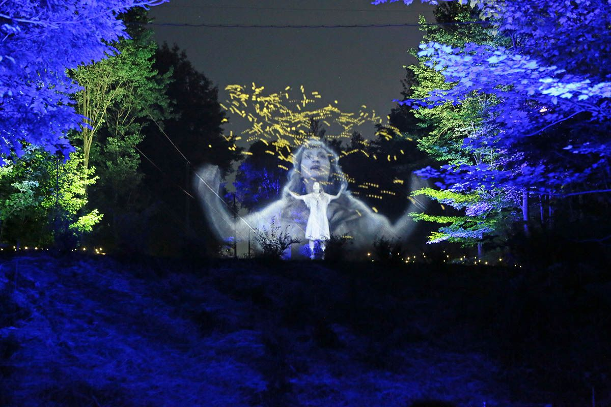
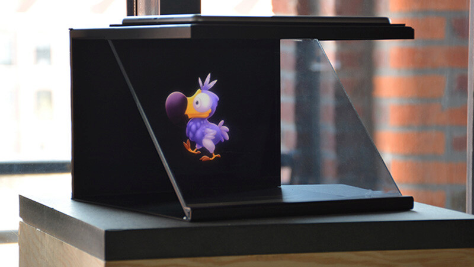

# PRÉSENTATION SUR LES HOLOGRAMMES
Présentation de la recherche d’un concept, d’une idée, d’une technologie, d’un traitement sur un support

## TYPE D'HOLOGRAMMES
* Hologrammes scénique
* Hologrammes vitrine
* Hologrammes pyramide
* Hologramme hélice

### HOLOGRAMMES SCÉNIQUE

#### MATÉRIEL
* vitre
* tissus très mince (tulle)
### HOLOGRAMMES VITRINES & PYRAMIDE

#### SOURCES
* https://www.3demotion.net/
