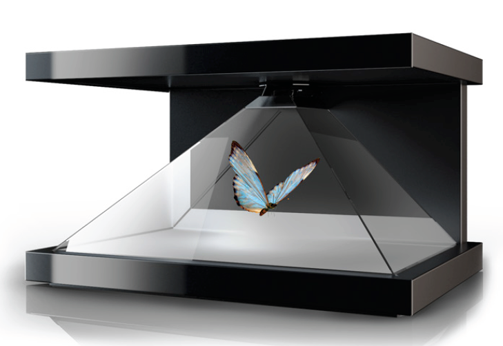
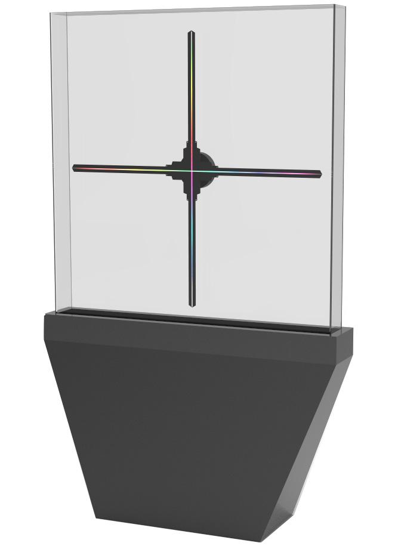

# PRÉSENTATION SUR LES HOLOGRAMMES
Présentation de la recherche d’un concept, d’une idée, d’une technologie, d’un traitement sur un support

## TYPE D'HOLOGRAMMES
* Hologrammes scénique
* Hologrammes vitrine
* Hologrammes pyramide
* Hologramme hélice

### HOLOGRAMMES SCÉNIQUE

### HOLOGRAMMES VITRINES & PYRAMIDE

### HOLGRAMMES AVEC HÉLICE

### MATÉRIEL
* hélice holographique
* tissus mince
* vitre
* projecteur
[liens vers video qui explique comment faire fonctionner l'élice avec un hologramme](https://www.youtube.com/watch?v=1Qrm0Y9UhVA)

#### SOURCES
* https://www.3demotion.net/
